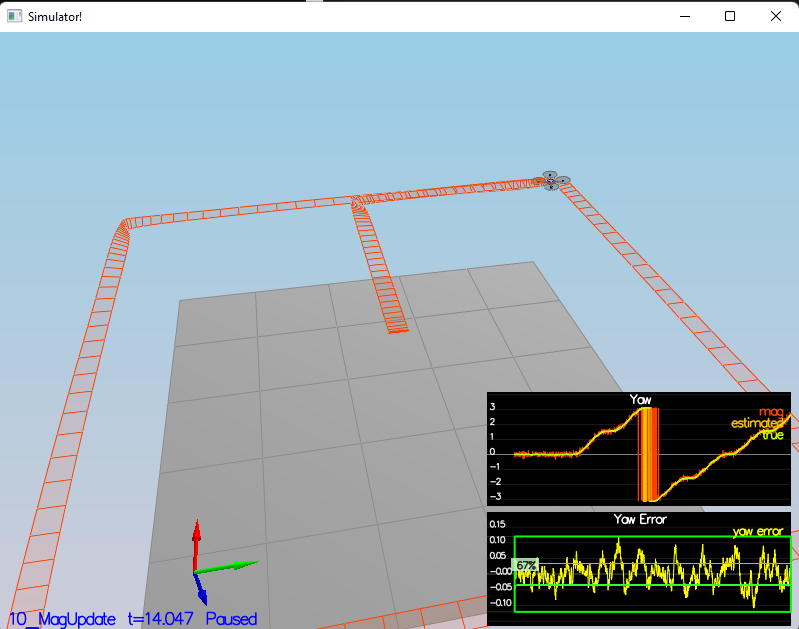

# Project Writeup

This project involved developing and tuning an Extended Kalman Filter (EKF) for state estimation in a quadcopter. The main tasks included implementing various parts of the EKF, improving sensor data handling, and ensuring the quadcopter could fly a specified trajectory using realistic sensor data.

/

# Requirements Addressed

## Measurement Noise Estimation

GPS X Data Standard Deviation: Estimated by analyzing the GPS data over time and computing the standard deviation. This involved collecting a sufficient amount of data and applying statistical analysis to determine the measurement noise.

Accelerometer X Data Standard Deviation: Similarly, the standard deviation for accelerometer data was determined using a similar statistical approach.

The source is in /scripts/calc_stats.py along with the data.

## IMU Update (Rate Gyro Attitude Integration)

In the UpdateFromIMU() function, a better rate gyro attitude integration scheme was implemented using quaternions. This replaced the simple small-angle approximation, improving the accuracy of attitude prediction.

## Prediction Step Implementation

All elements of the prediction step were implemented, including updating the state transition model and covariance matrix. The transition model accounted for the quadcopter's dynamics, using inputs like acceleration and gyro measurements.

Challenges: Initially, the implementation struggled with understanding how to correctly update the covariance matrix (ekfCov). Also the matrix I'm not still sure if it's in the right direction but seems to work.

## Magnetometer Update
This update considered the difference between measured and predicted yaw, ensuring the yaw angle was normalized within the range of [-pi, pi] to avoid issues with angle wrapping.

## GPS Update

The GPS update was implemented in the UpdateFromGPS() function. This step involved updating the position and velocity estimates using GPS measurements.

Code Improvement: During this implementation, I optimized the copying of state vector elements by using Eigen's head<6>() method, and the jacobian turned out to be an identity matrix. See comments in the file if in doubt.

## Performance Tuning and Final Trajectory
After implementing all the EKF components, the quadcopter's controller was de-tuned to ensure stable flight with realistic sensors. The final trajectory followed a box pattern, and the estimator performed adequately under realistic conditions.

Performance Issues: Initial difficulties included improper integration of acceleration into the state prediction, and misinterpretation of the transition model. These were resolved by reconsideration of the EKF equations and refining the implementation.
